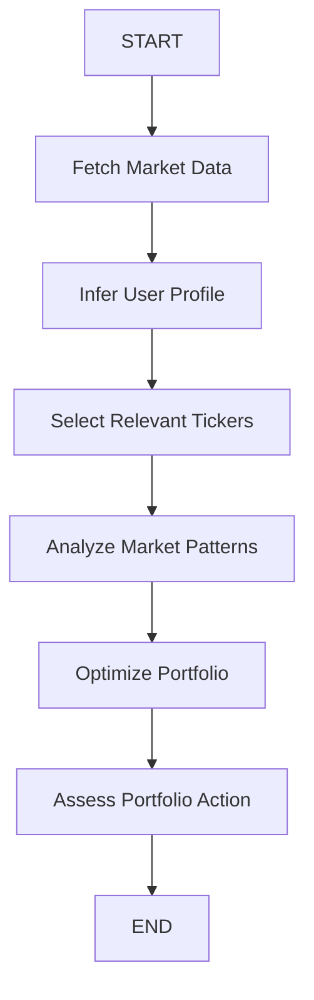

# 📈 AI-Powered Investment Portfolio Optimization Agent

An advanced financial agent built using **LangGraph**, **LangChain**, and **Streamlit** that automates the entire portfolio management lifecycle—from user profiling and ticker selection to risk-adjusted optimization and real-time market sentiment analysis.

## 🚀 Key Features

### 1. 🤖 AI-Driven User Profiling
- Infers your investment profile (risk appetite and horizon) from natural language descriptions.
- Preserves explicit user constraints while adding AI-powered insights.

### 2. 🔍 Dynamic Ticker Selection
- Recommends relevant stocks, ETFs, and sectors based on your preferences.
- Uses LLM reasoning to filter tickers that align with current market trends and your risk profile.

### 3. 📊 Advanced Portfolio Optimization
- **Max Sharpe Ratio (Tangency Portfolio)**: Automatically identifies the optimal risk-return trade-off.
- **Stable Dynamic Leverage**: Implements a prudent Equity Multiplier (up to 2.5x) to enhance returns without degrading portfolio efficiency.
- **Monte Carlo Simulations**: Runs thousands of simulations to calculate 95% Value-at-Risk (VaR) and Expected Shortfall.

### 4. 📰 Real-Time Market Intelligence
- **Sentiment Analysis**: Fetches and analyzes news headlines from Finnhub & Yahoo Finance.
- **Fundamental Analysis**: Pulls P/E ratios, Dividend Yields, Beta, and other key financial ratios.
- **Technical Indicators**: Generates SMA, RSI, and momentum charts.

### 5. 🏗️ Agentic Workflow (LangGraph)
- A multi-node state machine orchestrates the process:
  - `fetch_market_data` ➡️ `infer_user_profile` ➡️ `select_tickers` ➡️ `analyze_market` ➡️ `optimize_portfolio` ➡️ `assess_portfolio`.

## 🛠️ Tech Stack

- **Framework**: LangGraph, LangChain
- **LLM**: OpenAI (GPT-4o)
- **UI**: Streamlit
- **Financial APIs**: Finnhub, yfinance
- **Optimization**: CVXPY, NumPy, Pandas
- **Visualization**: Plotly, Altair

## ⚙️ Setup & Installation

1. **Clone the repository**:
   ```bash
   git clone <repository-url>
   cd "Investment Portfolio Optimization Agent using LangGraph"
   ```

2. **Install dependencies**:
   ```bash
   pip install -r requirements.txt
   ```

3. **Configure Environment Variables**:
   Create a `.env` file or set up Streamlit secrets:
   ```env
   OPENAI_API_KEY=your_openai_key
   FINNHUB_API_KEY=your_finnhub_key
   ```

4. **Run the Application**:
   ```bash
   streamlit run app.py
   ```

## 📈 Architecture

The system uses a **State Graph** approach where each node modifies a shared `AgentState` object. This ensures traceability and allows for complex conditional logic (e.g., rebalancing versus hedging based on market sentiment).



## 🛡️ Risk Management
- **Leverage Caps**: Strictly enforced limits to prevent over-exposure (Aggressive: 2.5x max).
- **Metric Sanitization**: Proper handling of percentage-based metrics (Dividend Yield, Beta) to ensure realistic projections.
- **Action Recommendations**: Context-aware suggestions (Hold, Rebalance, Hedge) based on portfolio-wide risk scoring.
